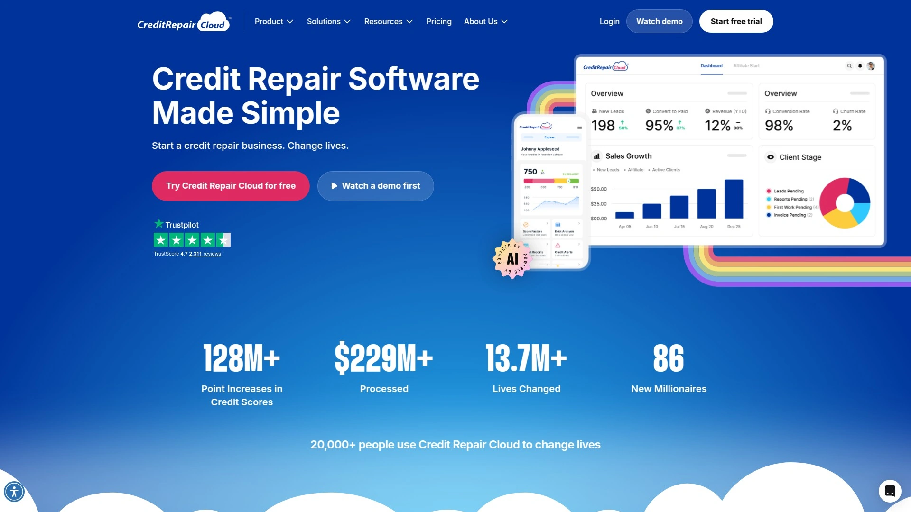
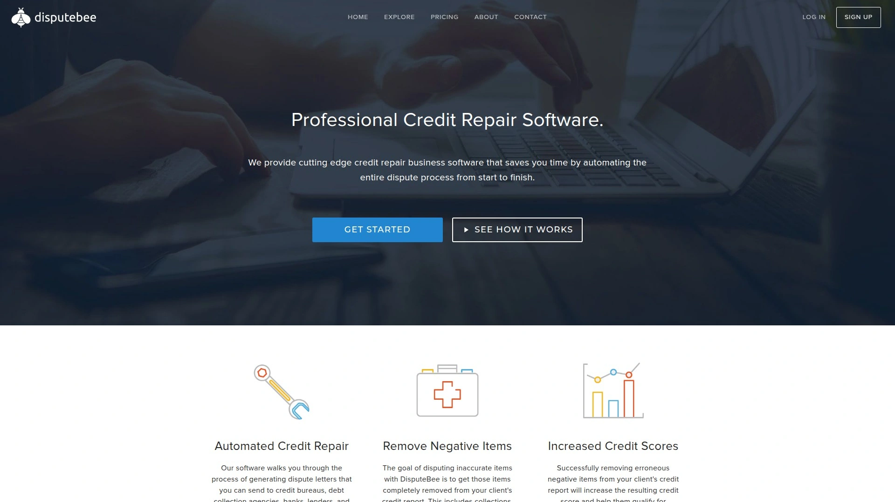
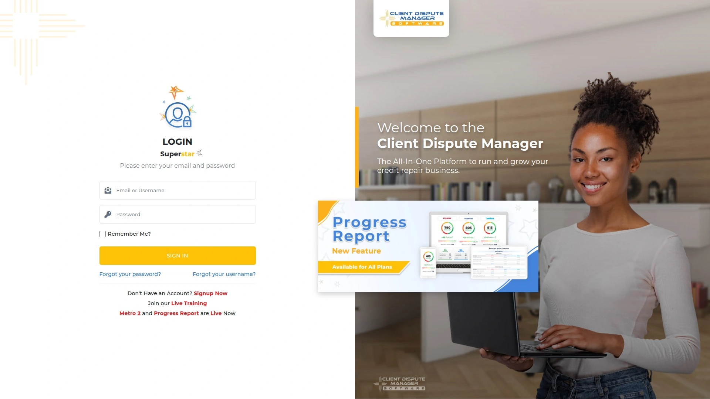
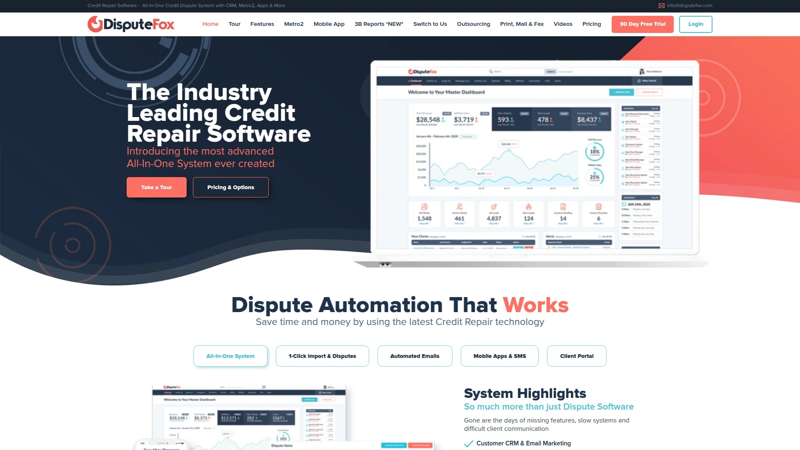
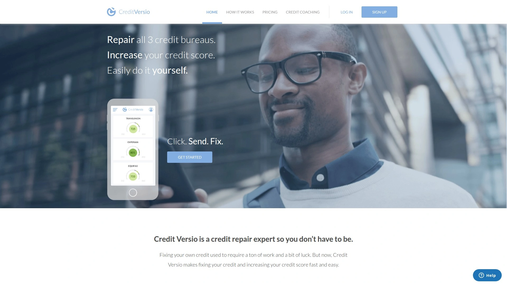
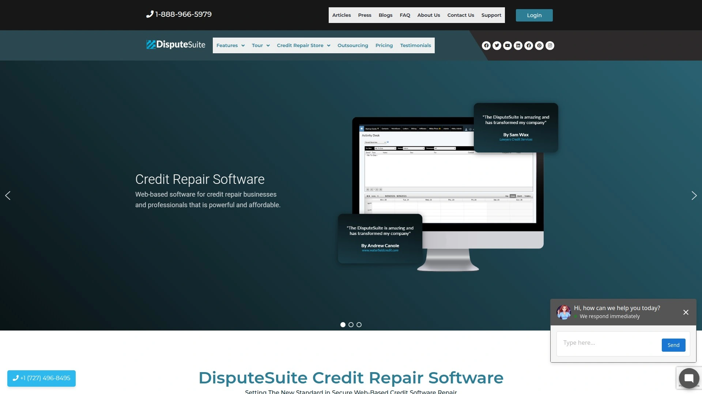

# 2025: 7 Top-Tier All-in-One Credit Repair Software Tools You Must Know

Running a credit repair business without proper software feels like trying to manage a law firm using Post-it notes and a filing cabinet from 1987. You're manually generating dispute letters, tracking client progress on spreadsheets that crash at the worst moments, missing follow-ups because there's no automated reminder system, and spending hours on administrative tasks that could take minutes with the right tools. Traditional approaches to credit repair business management waste valuable time that should be spent helping more clients improve their credit scores and grow revenue.

Modern credit repair software transformed the industry by automating dispute letter generation, centralizing client management, tracking credit bureau responses, and streamlining billing—all from cloud-based platforms accessible anywhere. These systems handle everything from importing credit reports and identifying negative items to creating Metro 2 compliant dispute letters and monitoring score improvements over time. Whether you're launching a new credit repair business, scaling an existing operation, or adding credit repair services to complement mortgage brokerage or real estate work, the right software accelerates client results while reducing administrative overhead dramatically.

***

## **[Credit Repair Cloud](https://www.creditrepaircloud.com)**

Industry-leading platform trusted by 20,000+ credit repair professionals with comprehensive automation.

Credit Repair Cloud stands as the pioneering software empowering credit repair businesses since helping the industry achieve 128 million+ point increases in credit scores across 13.7 million+ lives changed. The platform delivers everything needed to start, run, and scale a credit repair business including automated dispute letter creation using built-in AI, one-click printing and mailing of dispute letters, digital agreement signing for streamlined client onboarding, credit audit generation to convert leads into paying clients, and comprehensive client management tracking growth and automating payments.

Over 20,000 credit repair professionals across the US, Canada, and UK rely on Credit Repair Cloud to manage up to 2,400 clients and 24 team members simultaneously through robust dashboards providing complete visibility into every client's progress. The software imports credit report data and identifies errors instantly, then creates unique dispute letters using AI technology that adapts language to specific situations rather than sending generic templates flagged by credit bureaus. Metro 2 compliance tools ensure all communications meet federal regulations protecting both businesses and clients from legal complications.

The white-label client portal strengthens professional branding by giving clients 24/7 access to monitor their credit repair progress through your branded interface. In-built billing and invoicing tools eliminate the need for separate payment processors, while credit education and training resources help clients understand the process building trust and reducing support questions. Credit Repair Cloud earned recognition as one of the fastest-growing private companies in America and maintains mind-blowing reviews on Trustpilot with users praising its value-packed features and affordability.

For just $179 monthly after a 30-day free trial, credit repair experts access top-notch software that industry professionals consistently rank as their best tool. The platform serves credit repair professionals, agencies, financial consultants, tax professionals, and mortgage brokers seeking efficient software to fix credit profiles and boost client credit scores. Training resources guide users from beginner to pro through free and affordable expert instruction covering every aspect of credit repair business operations.

---

## **[DisputeBee](https://www.disputebee.com)**

Unlimited client management with automated dispute generation and zero learning curve.

DisputeBee positions itself as the close alternative to Credit Repair Cloud, specifically designed for credit repair professionals managing multiple clients who want cutting-edge software without unnecessary complexity. The platform supports unlimited clients and unlimited team members unlike competitors capping client counts, making it ideal for rapidly growing credit repair businesses scaling operations. For $129 monthly, the Business plan provides comprehensive features suitable for credit repair experts handling substantial client portfolios without hitting artificial growth limits.

The automated dispute letter generation imports credit reports and creates tailored dispute letters based on negative items found—late payments, inquiries, collections, or inaccuracies—then allows bulk printing to save time when serving many clients with smaller teams. DisputeBee supports all three major bureaus (Equifax, Experian, TransUnion) with dozens of dispute letter templates matching various credit profile situations. The software tracks dispute progress automatically and corresponds with credit bureaus for follow-ups, eliminating manual tracking systems prone to errors and missed deadlines.

Client portal functionality builds trust and professionalism by allowing clients to monitor credit repair progress independently rather than constantly requesting updates. The CRM solution manages client data, checks reports, provides score-fixing tips, and centralizes all customer information in one organized system. E-contract integration streamlines agreement signing making onboarding easier while ensuring formal documentation between businesses and clients. Zapier integration connects DisputeBee with other apps and tools needed to grow operations, extending functionality beyond native features.

Client billing happens directly through DisputeBee eliminating costs of using multiple payment tools and simplifying accounting. The platform emphasizes ease of use with minimal learning curve, earning appreciation from credit repair experts who can immediately apply their existing knowledge without struggling with complicated interfaces. While DisputeBee offers fewer advanced features compared to Credit Repair Cloud, it remains an excellent choice for small credit repair businesses prioritizing simplicity, unlimited client capacity, and affordable monthly costs.

---

## **[Client Dispute Manager](https://www.clientdisputemanager.com)**

AI-powered dispute engine with Metro 2 attack strategies and $50/month entry point.

Client Dispute Manager delivers complete credit repair business software helping professionals streamline workflows through automated dispute processes, secure document handling, compliance tracking, progress monitoring, and detailed reporting all in one platform. Trusted by 1,000+ credit repair companies across the USA with a 4.9 Google rating, the software combines affordability with powerful features making it accessible to new businesses while providing tools experienced companies need to scale.

The AI Rewriter and Metro 2 Attack Engine generate unique, compliant dispute letters in seconds following step-by-step Dispute Guide instructions when users feel stuck. Fast Checker instantly verifies deletions without requiring manual credit bureau logins, dramatically reducing time spent confirming results. The software provides a full vault of dispute strategies and legal letters going beyond basic templates, giving credit repair businesses competitive advantages through advanced tactics proven effective.

Automation saves hours through Client Auto Signup links enabling new clients to register themselves, one-click print integrations sending dispute letters faster, and Zapier connections automating tasks across entire workflows. Growth tools and resources including templates, strategies, and mastermind communities keep clients coming in while professionals work smarter not harder. Starting at just $50 monthly after free trials, Client Dispute Manager offers the most affordable entry point among comprehensive credit repair platforms.

Free 1-on-1 onboarding sessions five days weekly plus training videos on every screen provide step-by-step guidance eliminating confusion during setup. Exclusive certifications and courses sharpen credit repair skills helping businesses differentiate services and command premium pricing. Users report adding first customers and sending first disputes in under 15 minutes demonstrating the platform's intuitive design. The software emphasizes eliminating tedious tasks, freeing time, and enabling faster business scaling through smart automation rather than manual labor.

***

## **[DisputeFox](https://www.disputefox.com)**

Next-generation platform with Metro2 compliance and multi-step campaign automation.

DisputeFox markets itself as the most advanced credit repair software ever created, featuring tools like Metro2 compliance, mobile app access, SMS capabilities, web forms, automated workflows, and one-click credit report importing. The comprehensive all-in-one system handles dispute automation, CRM integration, branded client portals, multi-step campaigns, and direct USPS mailing from the platform. Tablet and mobile device accessibility ensures credit repair professionals can manage businesses from anywhere without being chained to desktop computers.

The software streamlines the entire dispute process through automation reducing manual work that traditionally consumed hours daily. Multi-step campaigns automatically nurture leads and clients through predetermined sequences, improving conversion rates and client retention without constant manual intervention. Metro2 compliance features ensure all communications meet federal credit reporting standards protecting businesses from regulatory issues. One-click USPS mail integration sends dispute letters directly from the platform eliminating trips to post offices and manual mailing processes.

Client management tools track every customer interaction, credit report changes, and dispute statuses in centralized dashboards providing complete visibility. The branded client portal reinforces professional identity by allowing customization matching business branding rather than generic white-label interfaces. Credit report importing happens with one click rather than tedious manual data entry, while credit score tracking monitors improvements automatically. Task management, billing and invoicing, email integration, SMS notifications, and document storage round out comprehensive business management capabilities.

DisputeFox positions itself as the solution for credit repair businesses wanting to save time and money using the latest technology, emphasizing that days of missing features and manual processes are over. The platform appeals to professionals prioritizing cutting-edge automation and comprehensive feature sets willing to invest in premium software delivering competitive advantages. Analytics and reporting provide insights into business performance, while user permissions control team access to sensitive information.

***

## **[ScoreCEO](https://scoreceo.com)**

Compliance-focused software with extensive training and done-for-you website options.

ScoreCEO offers complete all-in-one solutions designed to support credit repair businesses at every stage from startup through scaling operations. Thousands of credit repair companies trust ScoreCEO for comprehensive tools handling everything from dispute processing to automated client updates, with easy-to-use interfaces, built-in compliance checks, and automation capabilities ensuring businesses focus on growth without manual task burdens. The platform emphasizes compliance and success through tools that keep credit repair businesses operating within regulatory requirements while remaining competitive.

Seven-day free trials allow thorough testing before financial commitment, while dedicated training resources help users implement ScoreCEO effectively from day one. The credit repair business software simplifies dispute management through automation, reduces manual work while maintaining compliance, and provides 99 solutions to common credit repair business problems. Comprehensive client management, dispute tracking, letter generation, score monitoring, and business analytics centralize operations in single dashboards eliminating scattered tools and disconnected workflows.

ScoreCEO provides done-for-you websites specifically for credit repair businesses, offering professionally designed themes with built-in functionalities helping companies establish credible online presences quickly. This website service supports business growth by attracting qualified leads through optimized designs converting visitors into clients. The platform's mission centers on helping credit repair companies enhance productivity and improve client satisfaction through reliable software recognized as among the best in the industry.

Seamless lead and customer management combined with automated dispute processing and extensive training resources make ScoreCEO essential for growing and managing successful credit repair businesses. The software allows outsourcing dispute management while maintaining compliance, particularly valuable for businesses scaling operations beyond founder capacity. ScoreCEO serves credit repair companies nationwide from small startups to established operations seeking partners dedicated to business success rather than just software vendors.

***

## **[Credit Versio](https://www.creditversio.com)**

DIY-focused software with AI-powered dispute creation and affordable lifetime licensing.

Credit Versio differentiates itself as bilingual software (English and Spanish) available for individuals, households, and credit repair businesses seeking automated yet customizable solutions. The platform puts users in the driver's seat enabling customized credit repair approaches rather than one-size-fits-all automated systems, monitoring progress constantly and suggesting alternatives when initial strategies don't achieve desired outcomes. AI-powered software analyzes credit reports identifying errors automatically then guides users through dispute resolution processes.

The software imports credit report data from all three major bureaus and checks dozens of error types including duplicates, fraud, inaccuracies, late payments, and collections. During dispute creation, Credit Versio generates letters with proper wording for specific issues—inquiry disputes differ from collection account disputes—customizing language to maximize removal effectiveness. Users choose issues from dropdown menus triggering letter generation, then print and mail letters themselves maintaining full control over communications with credit bureaus.

Credit monitoring through SmartCredit/IdentityIQ provides the raw credit data powering Versio's analysis, with TransUnion credit rating updates twice monthly or unlimited depending on subscription level. Identity theft insurance protects users up to $25,000 in damages if identity theft occurs while subscriptions remain active. Extensive credit education resources including online courses help users understand credit scoring factors and develop strategies for improvement beyond just dispute letters.

Seven-day fully functioning free trials allow testing before purchase, with lifetime licenses priced at $399 for personal versions and $749 for business versions (reduced from $999). This DIY approach delivers greater control over credit repair compared to hiring companies, with significantly lower costs than ongoing service subscriptions. The trade-off requires users to do some work themselves and possess decent credit knowledge ensuring actions help rather than hurt credit profiles. Credit Versio earns 4.4 out of 5 stars on Trustpilot with generally positive customer reviews praising affordability and effectiveness.

***

## **[DisputeSuite](https://disputesuite.com)**

Multi-user platform with 360-degree customer views and professional dispute letter libraries.

DisputeSuite delivers comprehensive credit repair software streamlining business operations through powerful lead and customer management, automated dispute processing, and extensive training resources making it essential for growing and managing successful businesses. The multi-user software gives entire companies 360-degree views of each customer centralizing information accessible to sales teams, customer service representatives, and administrative staff simultaneously. This transparency improves coordination and ensures everyone remains informed about client statuses and needs.

Professional credit repair letter creation becomes point-and-click simple after downloading customer credit reports into the software. The platform develops professional letters from all three major bureaus (Equifax, TransUnion, Experian) using built-in dispute letter software and sample letters proving effective at resolving credit errors. Users can upload existing successful credit repair dispute letters into DisputeSuite customizing libraries with proven templates rather than starting from scratch.

Unlimited customer account management tracks activity across entire client bases without artificial limits restricting growth. Credit counseling businesses use DisputeSuite to align sales and customer service teams through interactive customer management tools improving internal coordination. Administrative teams at non-profit organizations and real estate offices spend less time helping customers perform disputes and download bureau information thanks to automation handling tedious tasks.

Learning and training materials pass along to staff developing more informed teams fully aware of credit repair strategies helping them perform jobs better. The platform serves any professional dealing with clients whose credit health impacts business relationships including credit counseling organizations, real estate professionals, and home-based entrepreneurs exploring credit repair business opportunities. DisputeSuite emphasizes providing all tools needed to start, run, and manage credit repair businesses as a leading provider in the industry.

***

## How much does credit repair software typically cost for small businesses?

Credit repair software pricing ranges from $50 to $179 monthly for comprehensive business platforms, with some offering free trials ranging from 7 to 30 days before commitment. Client Dispute Manager starts at $50 monthly making it the most affordable full-featured option, while DisputeBee costs $129 monthly and Credit Repair Cloud runs $179 monthly. Credit Versio offers alternative pricing with $399-$749 lifetime licenses eliminating ongoing subscriptions. Free trials allow testing features, importing actual credit reports, generating dispute letters, and evaluating interfaces before financial commitment.

## Can credit repair software really automate dispute letter creation and mailing?

Yes, modern platforms like Credit Repair Cloud, DisputeBee, and DisputeFox automatically generate customized dispute letters based on negative items identified in imported credit reports. AI engines analyze credit data and create unique letters rather than generic templates credit bureaus recognize and potentially ignore. Some platforms including DisputeFox offer one-click USPS mailing sending letters directly without manual printing and post office trips. Others generate PDFs for printing and mailing yourself, with bulk printing features processing many client letters simultaneously saving significant time for businesses managing dozens or hundreds of active cases.

## What makes Metro 2 compliance important in credit repair software?

Metro 2 represents the data furnishing format credit bureaus use for receiving and processing information from creditors and data furnishers. Credit repair software with Metro 2 Attack Engines or compliance features creates dispute strategies aligned with how bureaus actually process data, increasing effectiveness compared to generic consumer dispute letters. Platforms like Credit Repair Cloud, Client Dispute Manager, and DisputeFox emphasize Metro 2 compliance ensuring dispute letters and strategies work within established credit reporting systems rather than against them. This technical sophistication separates professional-grade business software from basic DIY tools, helping credit repair companies achieve better results for clients.

***

The difference between struggling to manage credit repair clients manually and running a streamlined, profitable business comes down to software automation handling tedious tasks while you focus on client relationships and business growth. Modern credit repair platforms eliminate hours of administrative work through AI-powered dispute generation, automated client communications, centralized progress tracking, and integrated billing systems that keep operations organized and efficient. Whether you're launching a new credit repair venture or scaling an existing business beyond capacity for manual processes, the right software multiplies productivity while maintaining compliance with complex federal regulations.

[Credit Repair Cloud](https://www.creditrepaircloud.com) particularly excels for credit repair professionals seeking industry-leading automation with comprehensive features proven by 20,000+ users managing 13.7 million+ client relationships—the platform delivers everything from AI dispute letter creation and one-click mailing to white-label client portals and Metro 2 compliance tools, all for $179 monthly with a 30-day free trial letting you experience the difference before commitment.
